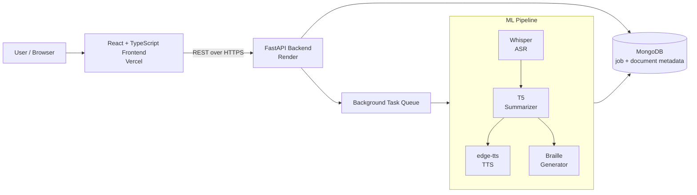
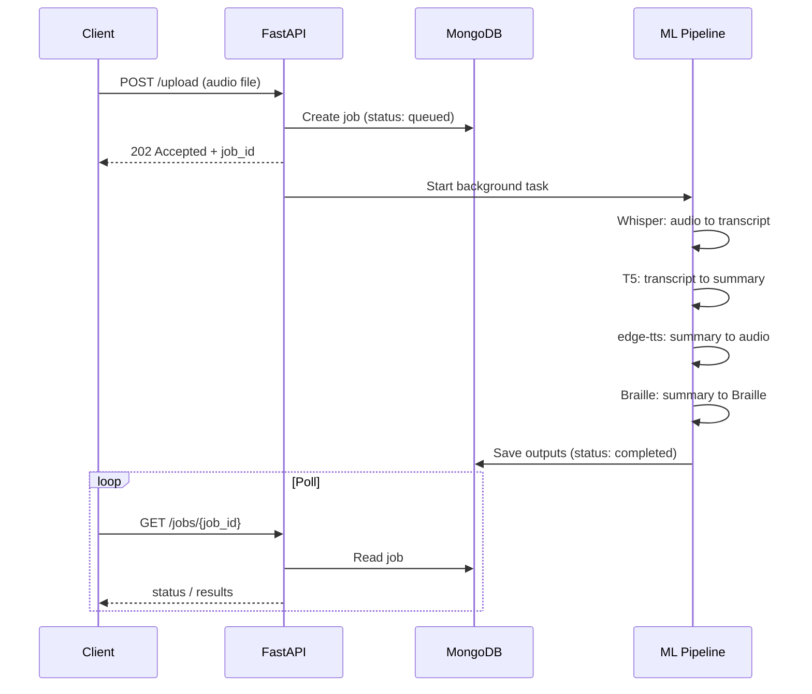

<div align="center">

# AccessLearnAI

**A multimodal lecture accessibility platform: spoken lectures in, transcripts, summaries, audio, and Braille out.**


[Live Demo](https://access-learn-ai-seven.vercel.app) · [Report a Bug](https://github.com/vishal-mundewadi/AccessLearnAI/issues)

</div>

---

## Table of Contents

- [Overview](#overview)
- [Features](#features)
- [System Architecture](#system-architecture)
- [Processing Pipeline](#processing-pipeline)
- [Tech Stack](#tech-stack)
- [Project Structure](#project-structure)
- [API Reference](#api-reference)
- [Getting Started](#getting-started)
- [Configuration](#configuration)
- [Deployment](#deployment)
- [Design Decisions and Trade-offs](#design-decisions-and-trade-offs)
- [Known Limitations](#known-limitations)
- [Roadmap](#roadmap)
- [Author](#author)

---

## Overview

Lecture content is mostly delivered as speech, which excludes students who are deaf or hard of hearing, and long recordings are hard to review for everyone else. Students who are blind or have low vision need non-visual formats.

AccessLearnAI takes a lecture recording and produces several accessible outputs from a single upload:

| Input | Output |
|-------|--------|
| Lecture audio | Full transcript |
| Transcript | Condensed summary |
| Summary | Spoken audio version |
| Summary | Braille text |

## Features

- **Speech-to-text** with OpenAI Whisper
- **Abstractive summarization** with a T5 model
- **Text-to-speech** with `edge-tts`
- **Braille generation** from the summarized text
- **Asynchronous job processing**, so uploads return immediately and results are fetched when ready
- **React + TypeScript frontend** for upload, progress, and results
- **Containerized backend** for reproducible environments

## System Architecture



The system has three layers:

1. **Presentation layer (`frontend/`)**: a single-page React app. It uploads audio, polls job status, and renders the transcript, summary, audio player, and Braille output.
2. **API layer (`backend/`)**: a FastAPI service that validates requests, stores job metadata in MongoDB, and hands heavy work to background tasks so request handlers never block on model inference.
3. **ML layer (`ml/`)**: independent modules for ASR, summarization, TTS, and Braille. Each stage takes the previous stage's output, which keeps stages testable and replaceable.

## Processing Pipeline



Each job moves through these states: `queued` → `processing` → `completed` or `failed`. Failures are recorded on the job document so the client can show a meaningful error instead of hanging.

## Tech Stack

| Layer | Technology |
|-------|------------|
| Frontend | React, TypeScript |
| Backend | Python, FastAPI, RESTful APIs |
| ASR | OpenAI Whisper |
| Summarization | T5 (Hugging Face Transformers, PyTorch) |
| TTS | edge-tts |
| Database | MongoDB (indexed metadata and aggregation pipelines) |
| Containerization | Docker |
| Hosting | Vercel (frontend), Render (backend) |

## Project Structure

```
AccessLearnAI/
├── backend/             # FastAPI application
│   ├── main.py          # App entry point and route registration
│   ├── routes/          # API route handlers
│   ├── services/        # Business logic and job orchestration
│   ├── models/          # Request/response and DB schemas
│   ├── requirements.txt
│   └── Dockerfile
├── frontend/            # React + TypeScript client
│   └── src/
├── ml/                  # ML pipeline modules
│   ├── asr/             # Whisper transcription
│   ├── summarizer/      # T5 summarization
│   ├── tts/             # edge-tts synthesis
│   └── braille/         # Braille conversion
├── .gitignore
├── package.json
└── package-lock.json
```

## API Reference

> Base URL (local): `http://localhost:8000` · Interactive docs: `/docs` (Swagger UI)

| Method | Endpoint | Description |
|--------|----------|-------------|
| `POST` | `/upload` | Upload a lecture audio file and create a processing job |
| `GET` | `/jobs/{job_id}` | Get job status and, when complete, the outputs |
| `GET` | `/jobs/{job_id}/audio` | Download the generated audio summary |
| `GET` | `/jobs/{job_id}/braille` | Download the Braille output |
| `GET` | `/health` | Service health check |

## Getting Started

### Prerequisites

- Python 3.10+
- Node.js 18+
- MongoDB (local or hosted)
- Docker (optional)

### Backend

```bash
git clone https://github.com/vishal-mundewadi/AccessLearnAI.git
cd AccessLearnAI/backend

python -m venv venv
source venv/bin/activate          # Windows: venv\Scripts\activate
pip install -r requirements.txt

uvicorn main:app --reload
```

### Frontend

```bash
cd frontend
npm install
npm run dev
```

### Docker

```bash
docker build -t accesslearnai-backend ./backend
docker run -p 8000:8000 --env-file backend/.env accesslearnai-backend
```

## Configuration

Create a `.env` file in `backend/`:

```env
MONGODB_URI=mongodb://localhost:27017/accesslearnai
```

Create a `.env` file in `frontend/`:

```env
VITE_API_BASE_URL=http://localhost:8000
```

| Variable | Used by | Description |
|----------|---------|-------------|
| `MONGODB_URI` | Backend | MongoDB connection string |
| `VITE_API_BASE_URL` | Frontend | Backend base URL; set to the deployed API URL in production |

## Deployment

| Component | Platform | Notes |
|-----------|----------|-------|
| Frontend | Vercel | Set `VITE_API_BASE_URL` to the deployed backend URL |
| Backend | Render | Docker-based deploy; see Known Limitations for RAM constraints |
| Database | MongoDB | Hosted instance, connection string via `MONGODB_URI` |

## Design Decisions and Trade-offs

**Background processing instead of synchronous requests.** Whisper and T5 inference can take far longer than a typical HTTP timeout. The API returns a `job_id` immediately and the client polls for status, which keeps the API responsive under load.

**Pipeline split into independent stages.** ASR, summarization, TTS, and Braille are separate modules with narrow interfaces. A stage can be swapped (for example a different summarizer) or tested on its own without touching the others.

**Indexed job metadata in MongoDB.** Jobs are looked up by id and status, so metadata fields used in queries are indexed, and aggregation pipelines handle reporting-style queries efficiently.

**Containerized backend.** Docker keeps the Python and ML dependency set identical across development, staging, and production, which matters because the PyTorch stack is sensitive to version mismatches.

## Known Limitations

- **Memory pressure on small hosts.** Whisper and T5 are loaded together and are memory-heavy. Free-tier instances can run out of RAM at model load, so the hosted backend may be slow or restart on very small plans.
- **Latency scales with audio length.** Long lectures take proportionally longer to transcribe and summarize.
- **Summarization quality** depends on transcript quality; noisy audio degrades the summary.

## Roadmap

- [ ] Lazy or on-demand model loading to fit smaller hosting tiers
- [ ] Smaller or quantized model variants
- [ ] Multi-language transcription and summarization
- [ ] QR-code access to results on mobile
- [ ] Downloadable transcript and Braille files
- [ ] Automated test suite and CI pipeline

## Author

**Vishal Mundewadi**
[GitHub](https://github.com/vishal-mundewadi) · [LinkedIn](https://linkedin.com/in/vishal-mundewadi)

Built as a major project at Ballari Institute of Technology and Management (BITM).
